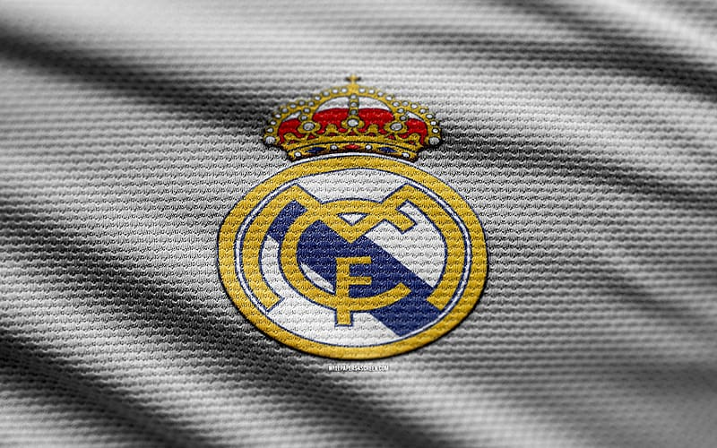

# UEFA 2015/2016 Database ⚽️

#### 🟨 Notă: proiectul este în dezvoltare, astfel că implementarea tabelelor în SQL nu se regăsește, momentan, în fișierele încărcate. Urmează să revin cu actualizări.

### 🥅 [RO]
## Informații generale
Acest proiect propune o implementare a unei baze de date relaționale concepută pentru a susține gestionarea informațiilor referitoare atât la campionatele interne organizate la nivelul statelor membre, cât și la competițiile internaționale de fotbal desfășurate în spațiul european, aflate sub coordonarea și reglementarea Uniunii Asociațiilor Europene de Fotbal (UEFA).

Modelul propus este raportat la sezonul competițional 2015/2016, care include competițiile europene de club UEFA Champions League (UCL), respectiv UEFA Europa League (UEL) și Campionatul European de Fotbal disputat între echipele naționale masculine de seniori ale membrilor UEFA (Euro 2016).

## 🟥 Constrângeri ale modelului propus (pe care consider că este necesar să le menționez și aici)
- Prin campionatul intern al unei țări se înțelege exclusiv prima ligă națională. Ligile inferioare nu sunt modelate;
- Modelul propus se limitează la campionatele masculine de seniori. Prin urmare, sunt excluse din model competițiile de tineret, cele feminine, precum și alte categorii de vârstă sau niveluri competiționale.

    

<em>hala madrid!</em>

### 🥅 [EN]
## General information
This project involves the development of a relational database designed to manage data concerning both domestic football leagues in UEFA member countries and international football tournaments regulated by the Union of European Football Associations (UEFA).

The proposed model is based on the 2015/2016 football season, which includes the European club competitions UEFA Champions League (UCL), UEFA Europa League (UEL), and the European Football Championship contested by the senior men's national teams of UEFA members (Euro 2016).

## 🟥 Constraints of the proposed model (which I find necessary to mention here)
- The domestic league of a country refers exclusively to the top national division. Lower divisions are not included in the model;
- The model is focused solely senior men's football leagues. Therefore, youth competitions, women's football, and other age categories or competitive levels are not represented.
